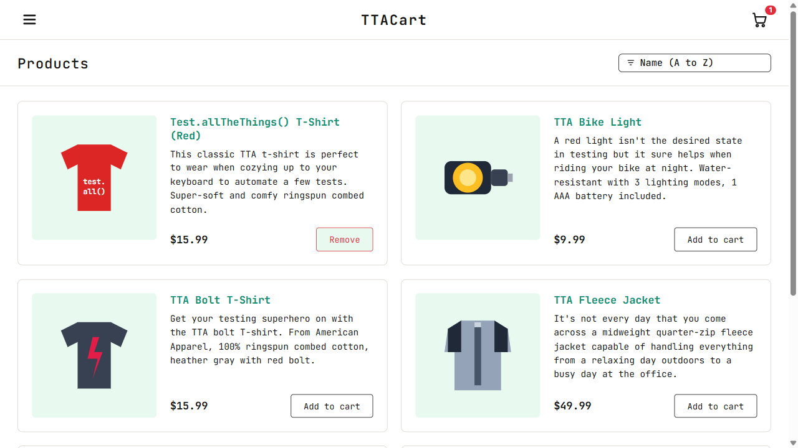
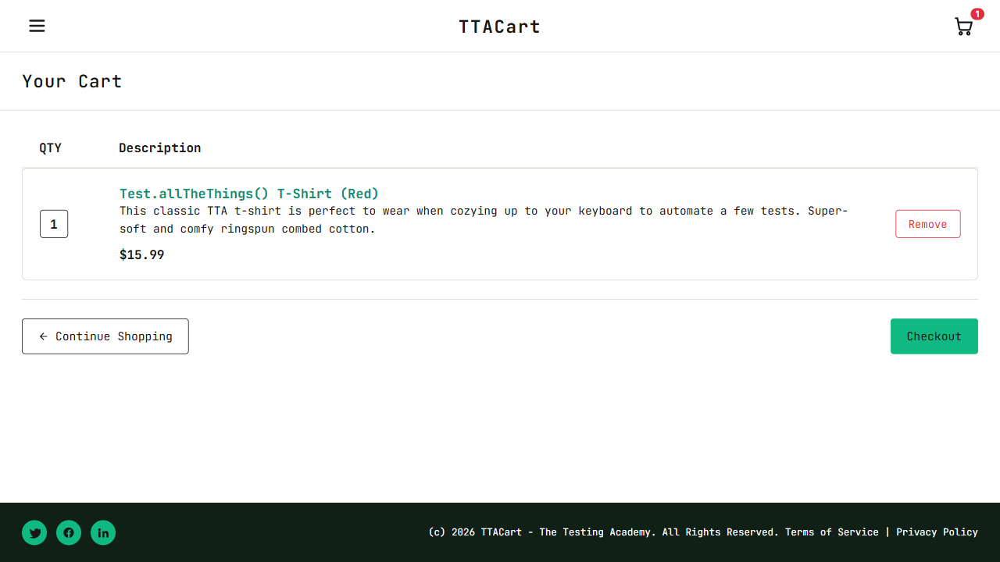
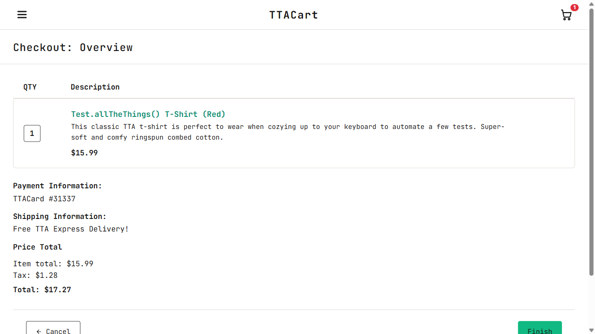
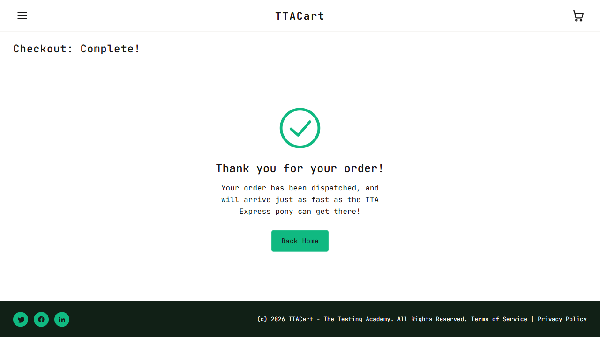

# Advanced Playwright Framework

This repository contains an advanced Playwright automation framework built with rule-based test folder structure and enforced quality checks.

## Project overview
- `package.json` contains scripts for linting, type checking, and Playwright testing.
- `tsconfig.json` is configured for TypeScript support across `src/` and framework utilities.
- `.github/` includes workflow and rule documentation files.
- `docs/phase1/` includes learning artifacts for the first phase of framework training.

## Folder structure
- `.github/`
  - `COPILOT_RULES.md` — Copilot rule guidance for the repository.
  - `workflows/` — GitHub Actions workflow configuration.
- `COPILOT_RULES.md` — root-level documentation for students and Copilot.
- `docs/phase1/`
  - `prompts.md` — conversation summary and phase-one guidance.
- `rule-name/`
  - `README.md` — rule folder guidance.
  - `test-quality-checks.md` — mandatory quality check instructions.
  - `example.spec.ts` — example test for the rule.
- `src/`
  - `api/`, `config/`, `fixtures/`, `pages/`, `testdata/`, `tests/`
  - `tests/README.md` — test folder guidance.
- `utils/` — shared utilities like `CustomReporter.ts` and `logger.ts`.

## Recommended workflow
1. Create or update a rule folder.
2. Add new test cases inside the correct rule folder.
3. Run `npm run typecheck`.
4. Run `npm run lint`.
5. Run `npm test` to execute the checks and run Playwright tests.

## Scripts
- `npm run check` — runs `typecheck` and `lint`.
- `npm run test` — runs `check` then executes Playwright tests.
- `npm run typecheck` — runs TypeScript `tsc --noEmit`.
- `npm run lint` — runs ESLint over the repository.

## Notes
- This framework is structured for clarity and maintainability.
- Students should use the `docs/phase1/prompts.md` file as the main learning reference for this stage.

## End-to-end checkout scenario
- Test source: `src/tests/e2e/e2e-checkout.spec.ts`
- Run command: `npx playwright test src/tests/e2e/e2e-checkout.spec.ts --headed --project=chromium`
- Custom report output: `tta-report/report_<timestamp>.html`
- Screenshots are captured under `tta-report/screenshots/` and shown below to illustrate the flow of the E2E checkout scenario.

### Scenario flow screenshots

